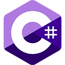

# Repositório Público do Aluno *Raphael Stefen Barreto*

## *JavaScript*

Aulas / Projetos de **JavaScript**
- [Aulas](https://stbitola.github.io/)
- [Projetos](https://stbitola.github.io/)

## *React Native*

Aulas / Projetos de **React Native**
- [Aulas](https://stbitola.github.io/)
- [Projetos](https://stbitola.github.io/)

## *Windows Forms*

Aulas / Projetos de **Windows Forms**
- [Aulas](https://stbitola.github.io/)
- [Projetos](https://stbitola.github.io/)

## *HTML5 & CSS3*

Aulas / Projetos de **HTML5 & CSS3**
- [Aulas](https://stbitola.github.io/)
- [Projetos](https://stbitola.github.io/)

## *Android*

Aulas / Projetos de **Android**
- [Aulas](https://stbitola.github.io/)
- [Projetos](https://stbitola.github.io/)
